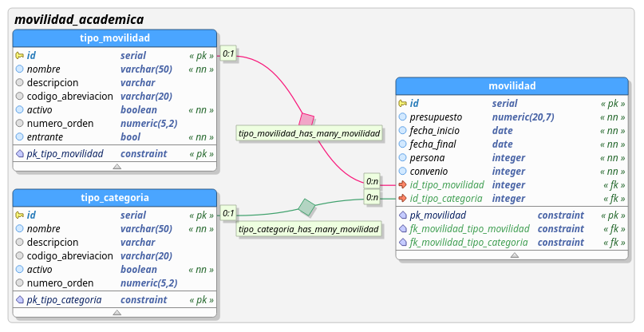

# Movilidad Academica CRUD

**movilidad_academica_crud**, CRUD para el negocio de movilidad academica. El proyecto está escrito en el lenguaje Go, generado mediante el **[framework beego](https://beego.me/)**.

### Modelo de Datos


Sql de la base de datos: **<a href="https://drive.google.com/file/d/1LJ_8nXmSo9lsoDzZPKfn6Q-7bdk8FZqK/view?usp=sharing" target="_blank">ceri BD</a>**


# Instalación
Para instalar el proyecto de debe relizar lo siguientes pasos:

## Opción 1

Ejecutar desde la terminal 'go get repositorio':
```shell 
go get https://github.com/udistrital/movilidad_academica_crud.git
```

## Opción 2

1. Clonar en el proyecto en la carpeta local: go/src/github.com/udistrital:
```shell
cd ~go/src/github.com/udistrital 
```

2. Ejecutar:

```shell 
git clone https://github.com/udistrital/movilidad_academica_crud.git
```

3. Ir a la carpeta del proyecto
```shell 
cd movilidad_academica_crud
```

4. Instalar dependencias del proyecto:
```shell 
got get
```


# Ejecución del proyecto
Ubicado en la raíz del proyecto,
```shell 
cd ~/go/src/github.com/udistrital/movilidad_academica_crud
```

- Ejecutar: 
```shell 
bee run
```
- O si se quiere ejecutar el swager:

```shell 
bee run -downdoc=true -gendoc=true
```

### Puertos
* El servidor se expone en el puerto: 127.0.0.1:8080

* Para ver la documentación de swagger: <a href="http://127.0.0.1:8080/swagger/" target="_blank">127.0.0.1:8080/swagger/</a>
### EndPoints

|                |link de prueba                  |End Point|
|----------------|-------------------------------|------------------------|
| **Obtiene datos asociados a la movilidad estudiantil** |<a href="http://127.0.0.1:8080/v1/movilidad" target="_blank">GetAll</a>|
| **Obtiene las categorías de movilidad** |<a href="http://127.0.0.1:8080/v1/tipo_categoria" target="_blank">GetAll</a>  |`127.0.0.1:8080/v1/tipo_categoria`|
| **Obtiene los tipo de movilidad(Extranjera o nacional)** |<a href="http://127.0.0.1:8080/v1/tipo_movilidad" target="_blank">GetAll</a>| `127.0.0.1:8080/v1/tipo_movilidad` |
